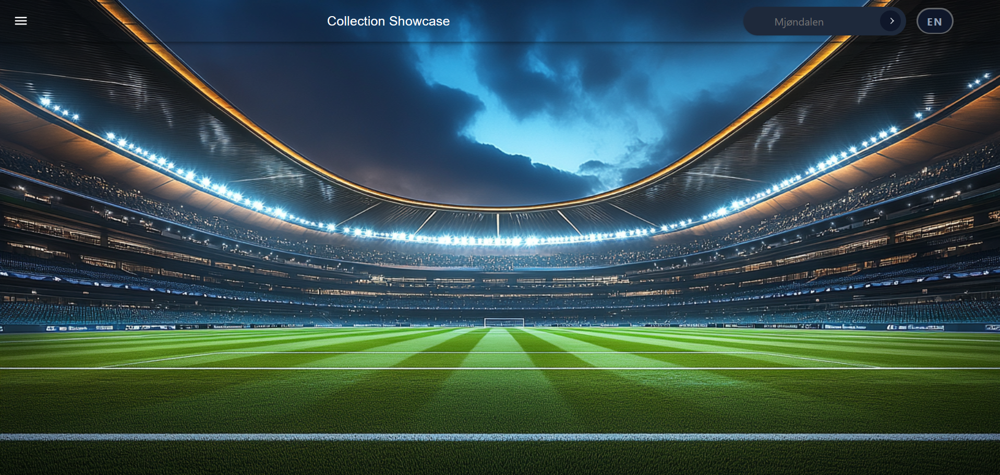
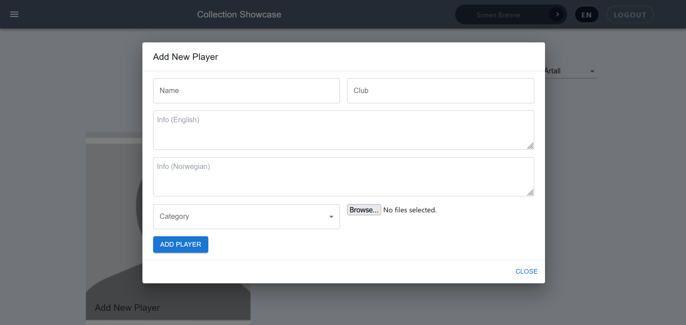

# Collection Showcase

A full-stack web application for showcasing a curated collection online. Originally built to display sports memorabilia, the app is designed to be generic and it can be adapted to present any kind of collection: vintage prams, vinyl records, stamps, model trains, and more.



## Features

- 🖼️ Browse collection items with images, descriptions, and categorization
- 🔍 Search and filter items by category and decade/era
- 🌍 Multi-language support (English / Norwegian)
- 🔐 Admin authentication for managing content
- ➕ Admin panel to add, edit, and remove items and categories
- 📄 Pagination for browsing large collections
- 📱 Responsive design



## Tech Stack

**Frontend**
- React 18
- Vite
- Tailwind CSS (with some remaining Material UI components — see [DECISIONS.md](./DECISIONS.md))
- React Router
- Redux
- Axios
- i18next (internationalization)

**Backend**
- Node.js / Express
- MongoDB with Mongoose
- JWT-based authentication
- Cloudinary for image storage, with Jimp for image compression

See [DECISIONS.md](./DECISIONS.md) for the reasoning behind these choices, including a couple of changes made along the way (e.g. AWS S3 → Cloudinary).

## Project Structure

```
collection-showcase/
├── client/ # React frontend (Vite)
└── server/ # Express backend API
```

## Getting Started

### Prerequisites

- Node.js (v20 or later recommended)
- A MongoDB database (local or [MongoDB Atlas](https://www.mongodb.com/atlas))
- A [Cloudinary](https://cloudinary.com) account (free tier is sufficient)

### Installation

1. Clone the repository
```bash
git clone https://github.com/emeliefogelstrom/collection-showcase.git
cd collection-showcase
```

2. Install server dependencies
```bash
cd server
npm install
```

3. Install client dependencies
```bash
cd ../client
npm install
```

### Environment Variables

**server/.env**
```
MONGODB_URL=your_mongodb_connection_string
JWT=your_jwt_secret
CLIENT_URL=http://localhost:3000
PORT=4000
CLOUDINARY_CLOUD_NAME=your_cloudinary_cloud_name
CLOUDINARY_API_KEY=your_cloudinary_api_key
CLOUDINARY_API_SECRET=your_cloudinary_api_secret
```

**client/.env**
```
VITE_API_URL=http://localhost:4000/api
```

### Running Locally

Start the backend:
```bash
cd server
npm start
```

Start the frontend (in a separate terminal):
```bash
cd client
npm run dev
```

The app will be available at `http://localhost:3000` (or the port Vite assigns).

## Admin Access

For security, there is no public sign-up. Create an admin account by running the seed script on the server:

```bash
cd server
node scripts/createAdmin.js
```

You'll be prompted for a username and password interactively.

## License

Apache-2.0